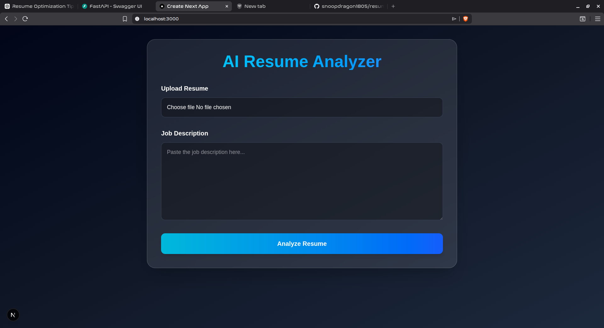
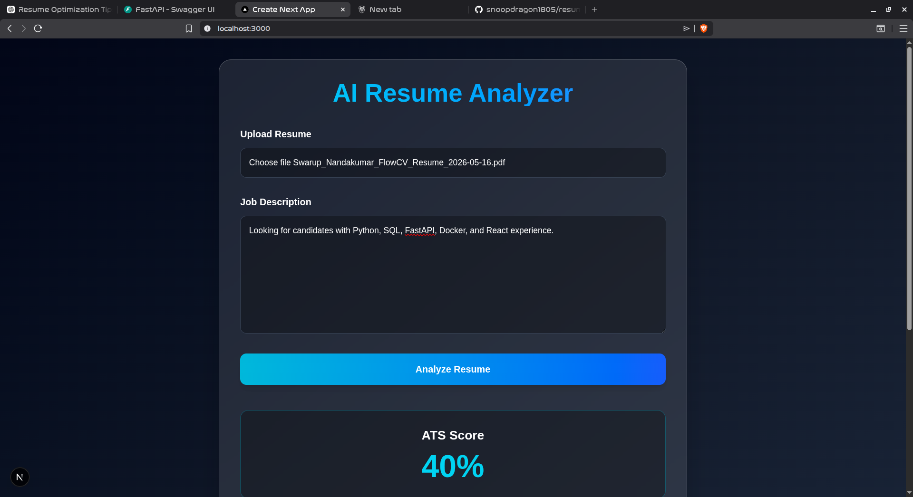
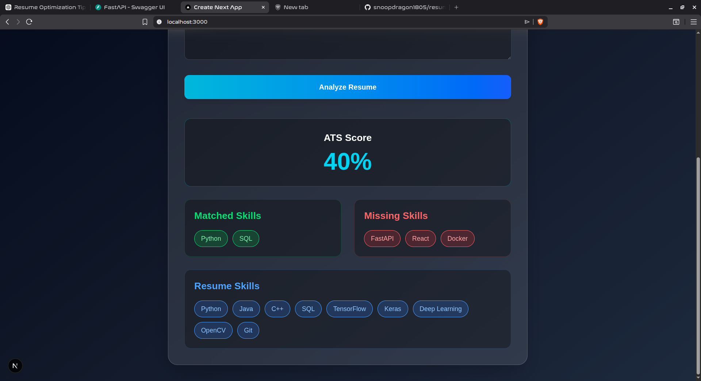

# AI Resume Analyzer

An AI-powered ATS Resume Analyzer built using FastAPI and Next.js that evaluates resume-job description compatibility through automated skill extraction and ATS scoring.

---

## Live Demo

https://your-vercel-url.vercel.app

## Features

- Upload Resume PDF
- Extract Resume Text Automatically
- Skill Extraction Engine
- Job Description Analysis
- ATS Compatibility Score
- Missing Skills Detection
- Modern Responsive UI
- Full-stack Architecture

---

## Tech Stack

### Frontend
- Next.js
- React
- Tailwind CSS

### Backend
- FastAPI
- Python

### Parsing & Processing
- PyMuPDF
- Custom Skill Extraction Engine

---

## Project Architecture

```text
Frontend (Next.js)
        ↓
FastAPI Backend
        ↓
PDF Parsing
        ↓
Skill Extraction
        ↓
ATS Scoring Engine
        ↓
JSON Response
```

---

## Screenshots

### Home Page



### ATS Analysis Result



---

## Installation

### Clone Repository

```bash
git clone https://github.com/snoopdragon1805/resume-analyzer.git
```

---

# Frontend Setup

```bash
cd frontend
npm install
npm run dev
```

Frontend runs on:

```text
http://localhost:3000
```

---

# Backend Setup

```bash
cd backend
python3 -m venv venv
source venv/bin/activate
pip install -r requirements.txt
uvicorn main:app --reload
```

Backend runs on:

```text
http://127.0.0.1:8000
```

---

## API Endpoint

### Upload Resume

```http
POST /upload-resume
```

### Request
- Resume PDF
- Job Description Text

### Response
```json
{
  "ats_score": 80,
  "matched_skills": [],
  "missing_skills": []
}
```

---

## Future Improvements

- AI Resume Suggestions
- Embedding-based Semantic Matching
- Resume Template Generator
- Authentication System
- Dashboard Analytics
- Cloud Deployment

---

## Author

Swarup Nandakumar

GitHub:
https://github.com/snoopdragon1805